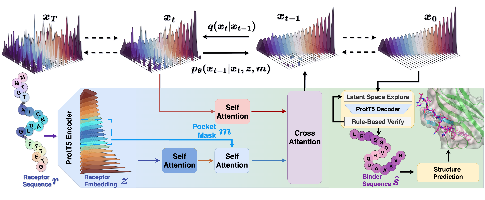

# PepEDiff-A-Peptide-binder-Embedding-Diffusion-Model

This repository contains the code for our model, PepEDiff. It includes the training and testing scripts used in the paper. We also provide a script that allows users to generate binders for any given receptor and pocket (see point 5).

For protein folding after generating binder sequences, we recommend using external tools. For example, you may use the [AlphaFoldServer](https://alphafoldserver.com/) or [Boltz](https://github.com/jwohlwend/boltz/tree/main) (the folding method used in this paper).


# 1. Environment setup

Create and activate the Conda environment from the provided environment.yml:
``` bash
conda env create -f environment.yml
conda activate pepediff
```

# 2. Prepare data

All pre-processed data files (training and testing) are available on Zenodo. (Still uploading...)

1. Download the pre-processed data from the Zenodo URL.

2. Place the downloaded files under the "data" directory.
   
# 3. Reproduce Training Results
Ensure training data is placed under "data" (see point 2).

Run the training script:
``` bash
python train_model.py
```

# 4. Reproduce testing results

Ensure testing data is placed under "data".

Run the sampling/testing script:

``` bash
python sample.py
```

After generating the binder embedding. Run the following script to transform the embedding back to sequence space:

``` bash
python emb_to_seq.py
```

# 5. Generate binders
We also provide a script to generate peptide binders given a receptor and pocket. The following is an example of generating 100 peptide binders of length 15 that bind to TIGIT, using specified pocket residues. The POCKET_IDX values should be separated by commas and are zero-indexed.

The generation configuration can be set through environment variables, or modified directly in the first few lines of the script.

``` bash
export GEN_NUM=100
export PEPTIDE_LEN=15
export POCKET_IDX="45,46,47,48,49,50,51,52,53"
export RECEPTOR_SEQ="MMTGTIETTGNISAEKGGSIILQCHLSSTTAQVTQVNWEQQDQLLAICNADLGWHISPSFKDRVAPGPGLGLTLQSLTVNDTGEYFCIYHTYPDGTYTGRIFLEVLESSVAEHGARFQIPLLGAMAATLVVICTAVIVVVALTRKKKALRIHSVEGDLRRKSAGQEEWSPSAPSPPGSCVQAEAAPAGLCGEQRGEDCAELHDYFNVLSYRSLGNCSFFTETG"
python sample_by_seq.py
```